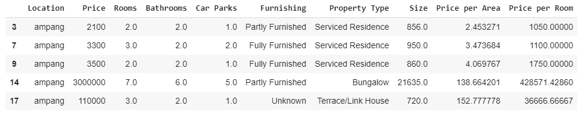

# Kuala Lumpur Neighborhood Analysis using Machine Learning Clustering algorithm
In this project we will compare different neighborhoods of Kuala Lumpur based on Real estate dataset (property prices, types, sizes) and venues around the neighborhood.

# Introduction

Kuala Lumpur, the capital of Malaysia is a home to about over 7 million people and is split into more than 40 districts. Each neighborhood has its own features and characteristics. Some are popular for parks and tourist attractions, while others are dense urban neighborhoods with office buildings and skyscrapers. There are neighborhoods mostly populated with local Chinese people, and places with large expat community.
There are industrial neighborhoods with houses for low income foreign labour, and areas such as Damansara Heights, the home of celebrities, politicians and rich people in general.

In this project we will compare different neighborhoods of the KL city based on property prices, types and venues around that neighborhood using machine learning clustering algorithms.

# Business Problem

There are many reasons people relocate within city boundaries, e.g. getting a new job offer, kids moving to different school or moving away from bad neighborhood etc. This project will help such people to compare different neughborhoods of Kuala Lumpur city in terms of property types, prices, size and most importantly the venues around specific neighborhood. If you're looking for a better neighborhood with more parks or coffee shops and restaurants but with similar real estate price, this is the place for you.

# Dataset
We will use the [dataset](https://www.kaggle.com/dragonduck/property-listing-analysis) created by Jan S available on [Kaggle](https://www.kaggle.com).
This dataset contains tens of thousands of property listings scraped from iproperty.com for every neighborhood of Kuala Lumpur city.
The dataset contains such information as number of rooms, bathrooms, parking slots, furnshing condition, property type and size as well as price per room and price per area for each listed property in iproperty.com.

For venues around each neighborhood we will gather data from Foursquare.com.

# Methodology
We will divide the project into multiple phases:

<b>Step 1 is Data wrangling.</b> Real estate dataset has many missing values, i.e. some properties missing the number of rooms info, others does not have the furnishing or size data. Rather than filling missing values we will simple remove the raws with NaN values, and still have a huge dataset with over 31000 property listings.

<b>Step 2 is Getting Latitude and Longitude coordinates for each  neighborhood.</b> We will use Geopy geocoders library to do so.

<b>Step 3 is Data analysis and clustering based on real estate data.</b> We will use onehot encoding to convert categorical data such as type of property and furnishing condition into numericla form. Next we will perform the K-means clustering algorithm. After few experiments we decided to set K=5.

<b>Step 4 is collecting data about each neighborhood using a Foursquare API.
  

We will collect 100 venues around each neighborhood based on longitude and latitude information.

Next we will select top 10 venue for each neighborhood and perform a onehot encoding.

<b>Step 5 is Clustering using venues dataframe.</b> 
In this we will performa the K-means clustering algorithm using venues dataset. We will use the same number of clusters as before (real estate clustering). 

<b>Step 6 is comparing both clustering results,</b> 
and see how different neighborhoods correlated in terms of real estate dataset as well as venues around them. 

# Results
First let's look at the Real estate dataset based clustering results:

We have 5 clusters. Let's analyse each cluster one by one.

<b>Cluster 0 (red circles)</b> is characterized by expensive properties with area size from 1500 to 4000 sqft. Most of the properties in this cluster are serviced residences and condominiums.  The price in this cluster is rather high, with price per room from RM400K all the way up to RM700K. The neighborhoods in this cluster are mostly located close to KL downtown, such as KLCC, Bukit Bintang, KL central, Seputeh.

<b>Cluster 1 (purple circle)</b> has only a single member: <b>Country Heights Damansara</b>. This is a luxury neighborhood with luxury villas (over 80% properties here are bungalows/villas). This is the home of celebrities, politicians and rich people in general. Properties in this area are rather huge with over 9000 sqft in average, 5 parking spots, and skyrocket prices (over RM1.5 million per room). 

<b>Cluster 2 (light blue circles)</b> includes the neighborhoods with properties for low to middle income families.  
